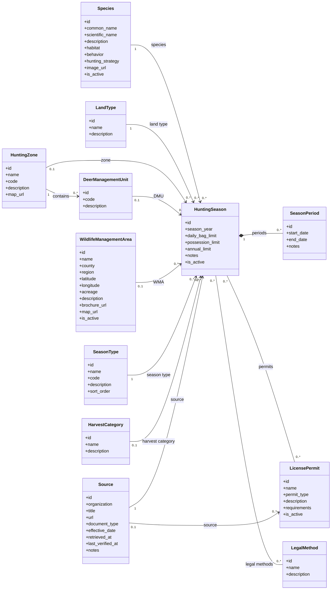

# HuntIt API

HuntIt is a proposed responsive web application that will help hunters locate wildlife and hunting requirements for supported Florida public and private lands. The application organizes information by species, hunting area, land type, and date, while allowing registered users to save search settings and maintain private harvest records.

This repository contains the **Python/Django backend** for HuntIt.

---

## Technology Stack

- Python 3
- Django
- Django REST Framework
- SQLite for local development
- Requests for retrieving official FWC pages
- BeautifulSoup4 for HTML parsing
- Git / GitHub for version control

---

## Prerequisites

Before initializing the project, install:

- Python 3
- pip
- Git

Verify the installation:

```bash
python --version
pip --version
git --version
```

---

## Project Initialization

### 1. Clone the repository

```bash
git clone <repository-url>
cd huntit-api
```

Replace `<repository-url>` with the GitHub URL of the project.

### 2. Create a virtual environment

From the project root:

```bash
python -m venv .venv
```

### 3. Activate the virtual environment

#### Windows — Git Bash

```bash
source .venv/Scripts/activate
```

#### Windows — PowerShell

```powershell
.\.venv\Scripts\Activate.ps1
```

#### Windows — Command Prompt

```cmd
.venv\Scripts\activate.bat
```

#### macOS / Linux

```bash
source .venv/bin/activate
```

When the environment is active, the terminal should show something similar to:

```text
(.venv)
```

### 4. Install project dependencies

If `requirements.txt` already exists:

```bash
pip install -r requirements.txt
```

## Django Setup

### 1. Apply database migrations

```bash
python manage.py makemigrations
python manage.py migrate
```

### 2. Create an administrator account

```bash
python manage.py createsuperuser
```

Follow the prompts to create the administrator credentials.

### 3. Run the development server

```bash
python manage.py runserver
```

The Django application is normally available at:

```text
http://127.0.0.1:8000/
```

The Django Admin interface is normally available at:

```text
http://127.0.0.1:8000/admin/
```

---

## Domain Model

The regulatory data model is centered around `HuntingSeason`.

A hunting season connects a species with the land type, hunting zone or Wildlife Management Area, season type, harvest category, optional Deer Management Unit, source, legal methods, permits, and one or more date periods.

### Main domain classes

- `Species`
- `HuntingZone`
- `DeerManagementUnit`
- `LandType`
- `SeasonType`
- `HarvestCategory`
- `Source`
- `WildlifeManagementArea`
- `LicensePermit`
- `LegalMethod`
- `HuntingSeason`
- `SeasonPeriod`

---

## Class Diagram

GitHub supports Mermaid diagrams directly inside Markdown files, so the following diagram should render automatically when this README is displayed on GitHub.



---
