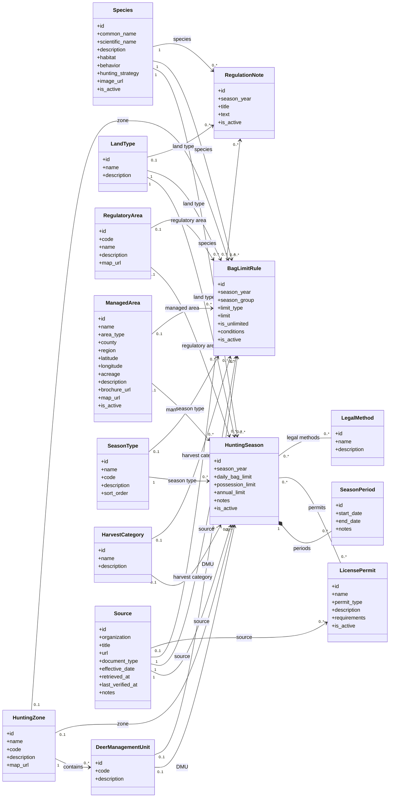

# HuntIt API

HuntIt is a proposed responsive web application that will help hunters locate wildlife and hunting requirements for supported Florida public and private lands. The application organizes information by species, hunting area, land type, and date, while allowing registered users to save search settings and maintain private harvest records.

This repository contains the **Python/Django backend** for HuntIt.

---

## Technology Stack

- Python 3
- Django
- Django REST Framework
- SQLite for local development
- Requests for retrieving official FWC pages
- BeautifulSoup4 for HTML parsing
- Git / GitHub for version control

---

## Prerequisites

Before initializing the project, install:

- Python 3
- pip
- Git

Verify the installation:

```bash
python --version
pip --version
git --version
```

---

## Project Initialization

### 1. Clone the repository

```bash
git clone <repository-url>
cd huntit-api
```

Replace `<repository-url>` with the GitHub URL of the project.

### 2. Create a virtual environment

From the project root:

```bash
python -m venv .venv
```

### 3. Activate the virtual environment

#### Windows — Git Bash

```bash
source .venv/Scripts/activate
```

#### Windows — PowerShell

```powershell
.\.venv\Scripts\Activate.ps1
```

#### Windows — Command Prompt

```cmd
.venv\Scripts\activate.bat
```

#### macOS / Linux

```bash
source .venv/bin/activate
```

When the environment is active, the terminal should show something similar to:

```text
(.venv)
```

### 4. Install project dependencies

If `requirements.txt` already exists:

```bash
pip install -r requirements.txt
```

---

## Django Setup

### 1. Apply database migrations

```bash
python manage.py makemigrations
python manage.py migrate
```

### 2. Create an administrator account

```bash
python manage.py createsuperuser
```

Follow the prompts to create the administrator credentials.

### 3. Run the development server

```bash
python manage.py runserver
```

The Django application is normally available at:

```text
http://127.0.0.1:8000/
```

The Django Admin interface is normally available at:

```text
http://127.0.0.1:8000/admin/
```

---

## FWC Regulation Importer

HuntIt includes a Django management command that downloads supported official Florida Fish and Wildlife Conservation Commission (FWC) pages, parses the regulatory information, normalizes the data, and stores it using the Django ORM.

The import pipeline is organized as follows:

```text
FWC Sources
    ↓
FWCClient
    ↓
Species / Source Parsers
    ↓
Normalizer
    ↓
FWCImporter
    ↓
Django ORM / Database
```

### Supported species

The initial importer supports four species:

- White Tailed Deer
- Wild Turkey
- Wild Hog
- Burmese Python

### Supported sources

| Source key               | Main data imported                                                                                                |
| ------------------------ | ----------------------------------------------------------------------------------------------------------------- |
| `season_dates`           | White Tailed Deer and Wild Turkey seasons, date periods, harvest categories, bag limits, and regulatory notes     |
| `wild_hog`               | Wild Hog private-land year-round regulations, legal methods, unlimited bag limit, and public-land regulatory note |
| `burmese_python_removal` | Burmese Python private-land rules and year-round removal rules for Commission-managed lands                       |

The `season_dates` source is downloaded only once and is shared by the Deer and Turkey parsers.

### Import all supported sources

If `--source` is omitted, the command imports all currently supported sources and all four supported species:

```bash
python manage.py import_fwc --season 2026-2027
```

The same behavior can be requested explicitly with:

```bash
python manage.py import_fwc --source all --season 2026-2027
```

### Import a single source

Import only Deer and Turkey data:

```bash
python manage.py import_fwc --source season_dates --season 2026-2027
```

Import only Wild Hog data:

```bash
python manage.py import_fwc --source wild_hog --season 2026-2027
```

Import only Burmese Python data:

```bash
python manage.py import_fwc --source burmese_python_removal --season 2026-2027
```

### Dry run

Use `--dry-run` to execute the complete parsing and import process without keeping database changes:

```bash
python manage.py import_fwc --season 2026-2027 --dry-run
```

A dry run is useful for validating parser and importer changes before updating the database.

### Command options

| Option      | Description                                                                                                                                             |
| ----------- | ------------------------------------------------------------------------------------------------------------------------------------------------------- |
| `--source`  | Source to import. Supported values are `all`, `season_dates`, `wild_hog`, and `burmese_python_removal`. If omitted, all supported sources are imported. |
| `--season`  | Hunting season year, for example `2026-2027`.                                                                                                           |
| `--dry-run` | Executes parsing and ORM operations but rolls back database changes.                                                                                    |

### Import behavior

The importer is designed to be repeatable. Existing records are updated when the same regulatory record is imported again instead of intentionally creating duplicates.

The current source-to-parser flow is:

```text
season_dates
├── FWCDeerParser
│   ├── Antlered Deer seasons
│   ├── Antlerless Deer seasons and DMU rules
│   ├── Deer bag limits
│   └── Deer regulation notes
│
└── FWCTurkeyParser
    ├── Fall seasons by Hunting Zone
    ├── Spring seasons by Regulatory Area
    └── Fall and Spring bag limits

wild_hog
└── FWCWildHogParser
    ├── Private Land YEAR_ROUND season
    ├── Legal methods
    ├── Unlimited general bag limit
    └── Public-land / WMA regulatory note

burmese_python_removal
└── FWCBurmesePythonParser
    ├── Private Land YEAR_ROUND season
    ├── Unlimited general bag limit
    ├── Commission-managed land rules
    └── ManagedArea records and YEAR_ROUND seasons
```

---

## Domain Model

The regulatory data model is centered around `HuntingSeason`, but season records are complemented by `SeasonPeriod`, `BagLimitRule`, and `RegulationNote` so that dates, limits, exceptions, and source-specific notes can be represented independently.

A hunting season connects a species with a land type and optional geographic scope. Geographic scope may be represented by a `HuntingZone`, `DeerManagementUnit`, `RegulatoryArea`, or `ManagedArea` depending on the species and regulation being represented.

### Main domain classes

- `Species`
- `HuntingZone`
- `DeerManagementUnit`
- `RegulatoryArea`
- `ManagedArea`
- `LandType`
- `SeasonType`
- `HarvestCategory`
- `Source`
- `LicensePermit`
- `LegalMethod`
- `HuntingSeason`
- `SeasonPeriod`
- `BagLimitRule`
- `RegulationNote`

### Geographic scope

HuntIt uses several geographic concepts because FWC regulations are not expressed using one universal area type:

- `HuntingZone` represents hunting zones such as Zones A–D.
- `DeerManagementUnit` represents Deer-specific management units such as A2, A3, or D2.
- `RegulatoryArea` represents broader regulatory divisions that are not hunting zones, such as `NORTH_SR70` and `SOUTH_SR70` for Spring Turkey.
- `ManagedArea` represents named managed lands such as WMAs, WEAs, PSGHAs, Small Game Areas, and National Wildlife Refuges.

### Bag limits

`BagLimitRule` stores structured harvest limits independently from `HuntingSeason`. Supported limit types currently include:

- `GENERAL`
- `DAILY`
- `POSSESSION`
- `SEASON`
- `ANNUAL`

A rule may contain a numeric `limit`, or use `is_unlimited = True` for regulations such as Wild Hog and Burmese Python where FWC specifies no bag limit.

`season_group` is used when a species has distinct groups of limits within the same hunting year, such as `FALL` and `SPRING` Turkey.

### Regulation notes

`RegulationNote` stores important regulatory text that does not naturally belong to a single season or bag-limit value, including exceptions, permit-related conditions, private-land rules, and area-specific warnings.

---

## Class Diagram

GitHub supports Mermaid diagrams directly inside Markdown files, so the following diagram should render automatically when this README is displayed on GitHub.



---

## Current Initial Data Scope

The first backend data scope is intentionally limited to four supported species so that the API can be designed and integrated with the frontend against real regulatory structures:

- White Tailed Deer
- Wild Turkey
- Wild Hog
- Burmese Python

Additional species and WMA-specific brochure parsing can be added after the initial API and frontend integration are stable.
